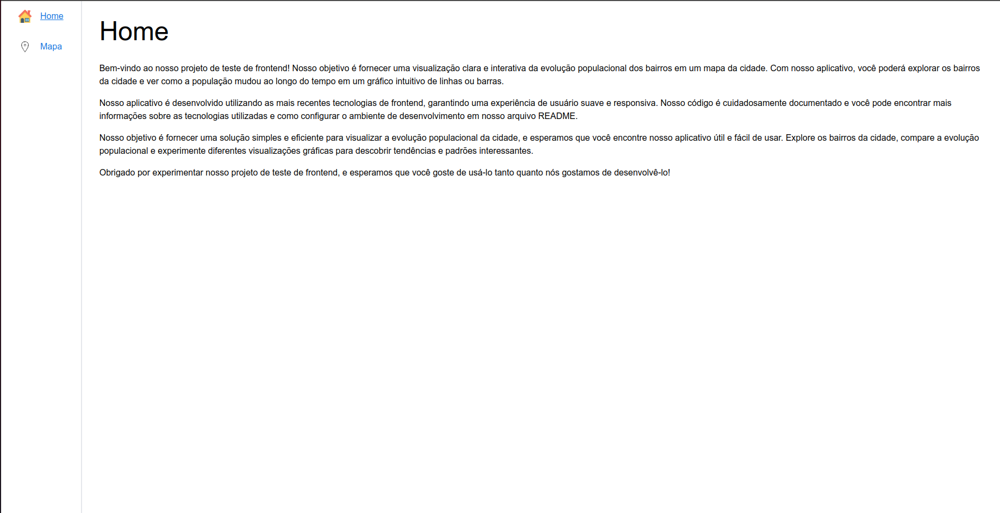
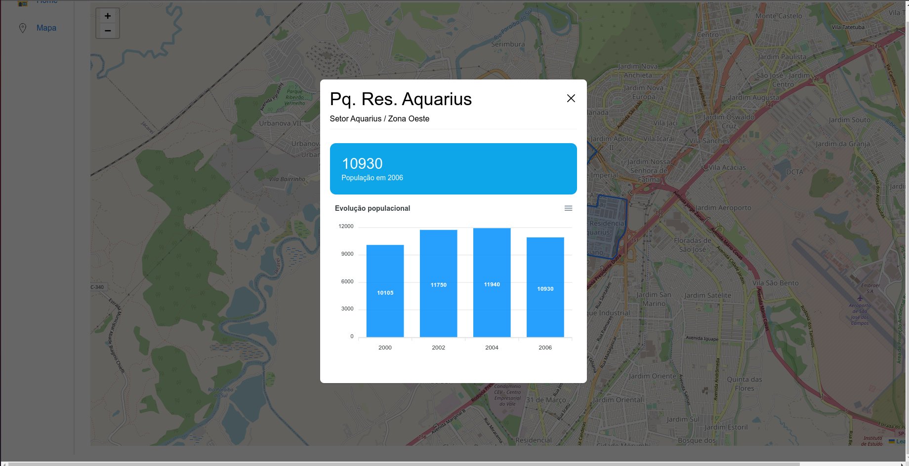

# Ubiratã
## Visão Geral do Projeto
Este é um projeto que usa Vue 3, Typescript, Vite, Vitest, Tailwind e Storybook. É uma stack de desenvolvimento web moderna que é rápida e eficiente para construir aplicativos web escaláveis.

## Preview
É possível visualizar uma página inicial explicando sobre o projeto e uma aba com o mapa para visualização que possui gráficos ao clicar nos bairros.
### Página Inicial


### Mapa


### Gráficos


## Começando
Para iniciar o projeto, siga os passos abaixo:

1. Clone o repositório em sua máquina local
2. Execute `npm install` para instalar as dependências do projeto
3. Execute `npm run dev` para iniciar o servidor de desenvolvimento
4. Abra seu navegador e acesse `http://localhost:3000` para ver a aplicação funcionando

## Estrutura de pastas
A estrutura de pastas do projeto é a seguinte:

```
.
├── dist                   # Arquivos compilados
├── public                 # Assets públicos
├── src                    # Código fonte
│   ├── api                # API (nesse caso mock da API)
│   ├── assets             # Assets estáticos
│   ├── components         # Componentes reutilizáveis
|   |   ├── tests          # Testes unitários dos componentes usando Vitest
│   ├── pages              # Componentes de página
|   |   ├── tests          # Testes unitários/de integração das páginas usando Vitest
│   ├── styles             # Estilos globais usando Tailwind
│   ├── App.vue            # Componente raiz
│   └── main.ts            # Entry point
├── .storybook             # Configuração do Storybook
├── tailwind.config.js     # Configuração do Tailwind
├── tsconfig.json          # Configuração do TypeScript
├── package.json           # Dependências e scripts
├── vite.config.ts         # Configuração do Vite
└── README.md              # Documentação do projeto
```

## Tecnologias e Funcionalidades
### Tecnologias
O projeto inclui as seguintes tecnologias:

- Vue 3 para construir interfaces de usuário reativas
- TypeScript para segurança de tipo e escalabilidade
- Vite para desenvolvimento e construção rápidos e eficientes
- Vitest para testes unitários
- Tailwind para estilos rápidos e consistentes
- Storybook para desenvolvimento e documentação orientados a componentes

### Funcionalidades
O projeto possui as seguintes funcionalidades:
- Exibe os bairros em um mapa
- Para cada bairro exibido mostra a evolução populacional ao longo do tempo em um gráfico de
barras.

## Scripts
O projeto inclui os seguintes scripts:

- `npm run dev`: Inicia o servidor de desenvolvimento
- `npm run build`: Builda o aplicativo pronto para produção
- `npm run test:unit`: Executa os testes unitários usando o Vitest
- `npm run storybook`: Inicia o servidor de desenvolvimento do Storybook
- `npm run build-storybook`: Builda a documentação do Storybook

## Conclusão
Este projeto é uma stack de desenvolvimento web moderna que é rápida e eficiente para construir aplicativos web escaláveis. Inclui todas as ferramentas e recursos necessários para desenvolver aplicativos de alta qualidade com facilidade.
